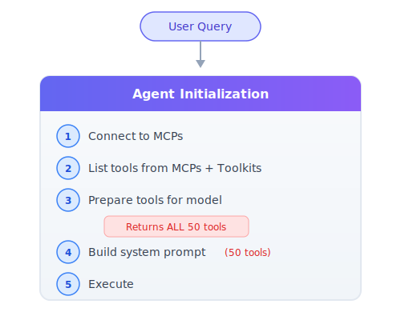
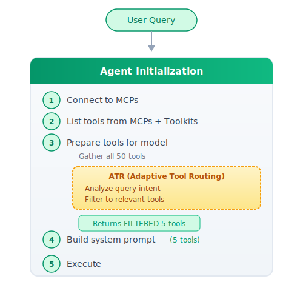

# Adaptive Tool Routing: Dynamic Tool Selection for MCP-Heavy Agents


<p align="center">
  
</p>

**TL;DR:** As agents accumulate MCP connections, they drown in tool definitions - burning context tokens and confusing themselves about which tools to use. Adaptive Tool Routing (ATR) fixes this by inserting a routing step into the agent's flow, filtering tools based on the user query before they reach the system prompt. This pattern led us to build [`adaptive-tools`](https://test.pypi.org/project/adaptive-tools/) - an open-source package that brings ATR to any agentic framework with a few lines of code.
<br clear="all" />

---

## Section I: The Problem  -  Tool Overload in the MCP Era

MCP (Model Context Protocol) is becoming the standard interface between AI agents and external capabilities. Bloomberg, YFinance, trading platforms, risk systems, portfolio managers - everything speaks MCP now. Teams are connecting their agents to every service they might need.

This is great for interoperability. It's terrible for your agent's performance.

### The Pattern We're Seeing

A typical enterprise agent might connect to:

- YFinance MCP (9 tools: stock prices, fundamentals, analyst recommendations, news, technical indicators)
- Bloomberg MCP (12 tools)
- Portfolio Management MCP (8 tools)
- Risk Analytics MCP (10 tools)
- Trading Execution MCP (6 tools)

**Total: 45 tools before the user says hello.**

This creates two catastrophic failure modes:

### 1. Context Explosion

Every tool comes with a schema definition that lives in the system prompt:

| Component | Tokens |
|-----------|--------|
| Average tool definition (name, description, parameters) | 200-300 |
| 5 MCPs × 10 tools each = 50 tools | **10,000-15,000** |
| Your actual system prompt instructions | 2,000-5,000 |
| **Total before conversation starts** | **12,000-20,000** |

You're burning 10-15% of your context window on tools the user probably won't need for this specific query. That's less room for conversation history, retrieved documents, and actual reasoning.

### 2. Tool Selection Degradation

More tools doesn't mean more capable. It means more confused.

Recent research quantifies this problem:

- **LongFuncEval (2025)** found **7-85% accuracy degradation** as tool catalog size increases, with 13-40% drops in multi-turn conversations ([arxiv](https://arxiv.org/abs/2505.10570))
- **Context Rot (Chroma, 2025)** tested 18 LLMs and found performance degrades non-uniformly as context length increases - even for simple tasks ([research.trychroma.com](https://research.trychroma.com/context-rot))
- **"Context Length Alone Hurts" (EMNLP 2025)** showed **13.9-85% performance drops** even with perfect retrieval - the length itself causes degradation ([arxiv](https://arxiv.org/abs/2510.05381))

**Common failure modes with large tool catalogs:**

- **Wrong tool selection:** Agent picks `get_stock_fundamentals` when it needed `get_key_financial_ratios`
- **Tool hallucination:** Agent invents tool names or parameters that don't exist
- **Coordination failures:** Multi-step tasks require tools from different MCPs, agent loses track
- **Analysis paralysis:** Agent wastes tokens reasoning about which tool to use

---

## Section II: The Core Insight

> Giving an agent access to 50 tools when it only needs 3 for the current task is like handing someone a 200-page manual when they asked how to turn on the TV.

Most agentic frameworks follow a standard initialization flow:

1. Connect to MCPs and toolkits
2. List/gather all available tools
3. Flatten tools into a single list
4. Build system prompt with tool definitions
5. Execute with user query

**The ATR intervention point:** Insert a routing step between steps 3 and 4. Before tools are added to the system prompt, analyze the user query and filter to only relevant tools.

**Token math:**

| Approach | Calculation | Tokens |
|----------|-------------|--------|
| Before ATR | 50 tools × 250 tokens | 12,500 |
| After ATR | 5 filtered tools × 250 tokens | 1,250 |
| **Savings** | | **90%** |

---

## Section III: The ATR Architecture

ATR isn't a separate orchestration layer - it's a step integrated into the agent's existing initialization flow.

<div style="display: flex; gap: 20px; flex-wrap: wrap; justify-content: center; margin: 30px 0;">
  <div style="flex: 1; min-width: 300px; max-width: 450px;">
    <h4 style="text-align: center; margin-bottom: 10px;">Standard Agent Initialization (Before ATR)</h4>
    
  </div>
  <div style="flex: 1; min-width: 300px; max-width: 450px;">
    <h4 style="text-align: center; margin-bottom: 10px;">Agent Initialization With ATR</h4>
    
  </div>
</div>

### The Integration Point

The key is intercepting tool resolution before tools reach the system prompt.

**The Pattern:**

1. **Gather phase** - Collect all tools from MCPs, toolkits, and direct tool definitions into a flat list (standard framework behavior)
2. **Route phase** - Pass the user query + full tool list to a routing function that returns only relevant tools
3. **Return phase** - Return the filtered subset instead of the full list

The routing function receives the query and tool definitions (IDs, names, capability tags), analyzes what capabilities are needed, and returns a filtered subset. This filtered list is what gets serialized into the system prompt.

---

## Section IV: The Routing Logic - Intent-Based Tool Selection

The routing function uses a lightweight LLM call to classify which tools are relevant to the user's query.

1. **Input preparation** - Format tools as lightweight summaries: `{name, description}`. Skip parameter schemas to minimize tokens. Truncate long descriptions.

2. **LLM routing call** - Single prompt asking a small model to select relevant tools:
   - The user query
   - Tool summaries (name + truncated description)
   - Instruction to return only tool names, one per line
   - Use a fast/cheap model (e.g., GPT-4o-mini, Claude Haiku)

3. **Filter and return** - Parse the tool names from the response, filter the original tool list to only those names.

**Example prompt structure:**

```
User query: "What is the current price of AAPL?"

Available tools:
- get_current_stock_price: Get the current stock price for a ticker
- get_company_info: Get company information and description
- get_stock_fundamentals: Get fundamental data like market cap...
- get_analyst_recommendations: Get analyst recommendations...
- get_company_news: Get recent news articles for a company
- get_technical_indicators: Get technical indicators like RSI...
- get_historical_stock_prices: Get historical price data...

Select the tools needed for this query. Return only tool names, one per line.
```

**Expected output:**

```
get_current_stock_price
```

**Overhead:** ~100ms, ~200-400 tokens

**Why lightweight summaries work:** The filter model doesn't need parameter schemas to understand capability. `get_current_stock_price: Get the current stock price for a ticker` is enough context to match against "What is the current price of AAPL?"

**Handling multi-step queries:** Even for queries like "Show me Tesla's historical prices and technical indicators", the same pattern works - the filter model simply returns multiple tool names:

```
get_historical_stock_prices
get_technical_indicators
```

The key is conservative selection with overlap tolerance - if the model is unsure between similar tools, it includes both. A `max_tools` cap prevents runaway selection.

---

## Section V: From Pattern to Package - `adaptive-tools`

After implementing this pattern across several internal projects, we kept writing the same routing logic, the same prompt templates, the same adapter code for each framework. So we packaged it.

[`adaptive-tools`](https://test.pypi.org/project/adaptive-tools/) (ATR) is an open-source Python package that implements the routing pattern described above with zero core dependencies, pluggable LLM providers, and adapters for every major agentic framework.

### Installation

```bash
# Core + OpenRouter (recommended - access to many models via single API key)
pip install -i https://test.pypi.org/simple/ adaptive-tools[openrouter]

# With LangGraph support
pip install -i https://test.pypi.org/simple/ adaptive-tools[langgraph]

# Everything
pip install -i https://test.pypi.org/simple/ adaptive-tools[all]
```

### Core Concepts

The package has three building blocks:

**`ToolSpec`** - A framework-agnostic tool representation. Just a name, description, and optional metadata:

```python
from atr import ToolSpec

spec = ToolSpec(
    name="get_stock_price",
    description="Get the current stock price for a ticker symbol",
    parameters={"type": "object", ...},  # Optional JSON Schema
    source="mcp:yfinance",               # Optional origin identifier
)
```

**`ToolRouter`** - The main entry point. Registers tools, routes queries, returns filtered results:

```python
from atr import ToolRouter
from atr.llm import OpenRouterLLM

router = ToolRouter(
    llm=OpenRouterLLM(model="anthropic/claude-3-haiku"),
    max_tools=5,
)

router.add_tools([
    ToolSpec(name="get_stock_price", description="Get current stock price"),
    ToolSpec(name="get_company_news", description="Get company news articles"),
    ToolSpec(name="get_weather", description="Get weather for a location"),
    ToolSpec(name="send_email", description="Send an email"),
    ToolSpec(name="create_calendar_event", description="Create a calendar event"),
])

filtered = router.route("What is AAPL's stock price?")
print(filtered.names)  # {'get_stock_price'}
```

**`ToolCollection`** - The routing result. Provides convenient access to filtered tools:

```python
filtered.names                        # Set of tool names
filtered.filter_by_names(["tool1"])   # Further filtering
len(filtered)                         # Number of tools
"get_stock_price" in filtered         # Membership check
```

### Adapters - Bridging Frameworks

The real power is in adapters. Every major framework represents tools differently - LangChain uses `BaseTool`, Agno uses `Function`, OpenAI uses JSON dicts. ATR adapters convert between these and `ToolSpec`:

```python
from atr.adapters import LangChainAdapter, MCPAdapter, AgnoAdapter, OpenAIAdapter

# Convert framework tools → ToolSpecs (for routing)
specs = LangChainAdapter.to_specs(langchain_tools)
specs = MCPAdapter.to_specs(mcp_tools)

# After routing, filter original tools by the result
filtered_tools = LangChainAdapter.filter_tools(langchain_tools, filtered_specs)
filtered_tools = MCPAdapter.filter_tools(mcp_tools, filtered_specs)
```

Every adapter follows the same two-method pattern: `to_specs()` to convert in, `filter_tools()` to filter back. The original framework objects are preserved - ATR never modifies your tools.

The package includes built-in integrations for LangGraph (routing nodes), Agno, OpenAI Agents SDK, LiteLLM, and raw MCP. See the [`examples/`](https://github.com/yess-ai/atr/tree/main/examples) directory in the repo for complete working examples with each framework.

---

## Section VI: When to Use ATR

### Use ATR When:

| Condition | Why It Helps |
|-----------|--------------|
| **15+ tools configured** | Context savings become significant |
| **Diverse tool domains** | Pricing + Fundamentals + Technicals + News - users rarely need all |
| **Cost/latency sensitive** | Every token saved compounds at scale |
| **Unpredictable user queries** | Can't pre-determine which tools are needed |

### Skip ATR When:

| Condition | Why ATR Is Overkill |
|-----------|---------------------|
| **Under 10 focused tools** | Context overhead is manageable |
| **Homogeneous tasks** | Same tools always needed |
| **Ultra-low latency (<100ms)** | Routing adds 100-300ms overhead |
| **All tools always relevant** | No filtering benefit |

### The Break-Even Calculation

```
Routing overhead:  ~100-300ms + ~500 tokens (routing LLM call)
Context savings:   ~10,000-15,000 tokens (avoided tool definitions)

Break-even at:     ~15-20 tools
Clear win at:      30+ tools
```

---

## References

- [LongFuncEval: Function Calling in Long Contexts (2025)](https://arxiv.org/abs/2505.10570)  -  Quantifies tool selection degradation
- [Context Rot: How Input Tokens Impact LLM Performance (Chroma, 2025)](https://research.trychroma.com/context-rot)  -  Context length degradation research
- [Context Length Alone Hurts LLM Performance (EMNLP 2025)](https://arxiv.org/abs/2510.05381)  -  Even perfect retrieval can't overcome length penalties
- [MCP Tool Overload (lunar.dev)](https://www.lunar.dev/post/why-is-there-mcp-tool-overload-and-how-to-solve-it-for-your-ai-agents)  -  Practical MCP scaling challenges
- [Tool Filtering for MCP Performance (tetrate.io)](https://tetrate.io/learn/ai/mcp/tool-filtering-performance)  -  MCP optimization strategies
