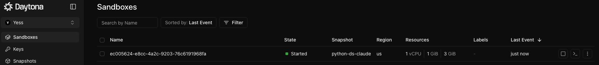
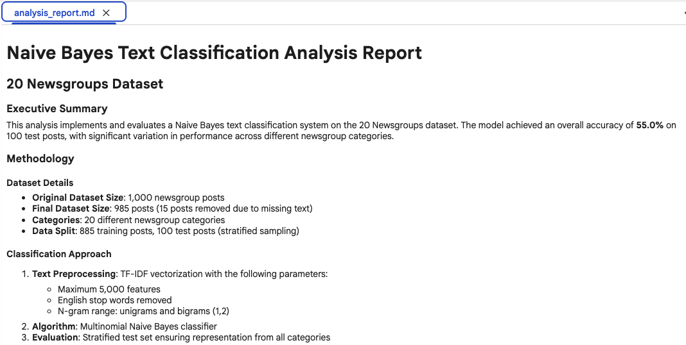
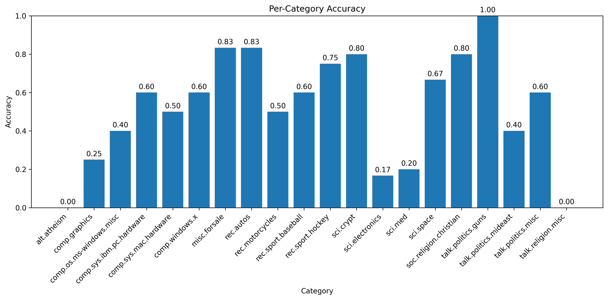

# Autonomous Adaptive Analytics: Safe Agents that Analyze, Execute, and Explain


**TL;DR:** Build an autonomous AI agent that detects issues, writes code, self-heals from errors, and delivers production-ready analysis, all inside secure, isolated sandboxes.

---

## **Section I: Why AI Analytics Still Falls Short**

**The Problem:** It's 3 AM. Your ML pipeline fails on row 4,732 (NULL value). A data scientist wakes up, debugs for 90 minutes, adds `.dropna()`, and restarts. The analysis completes, but required manual intervention.

**Current AI systems can't adapt autonomously.** When analyses hit unexpected issues (distribution drift, missing data, failed assumptions), they stop and wait for humans. Static pipelines lack decision-making capabilities.

**Our Solution:** A closed-loop AI agent running in secure, isolated sandboxes that:

- **Detects issues**: Missing data, errors, invalid assumptions
- **Decides & adapts**: Retry with fixes, pivot methods, adjust parameters
- **Executes autonomously**: Writes code, self-heals, continues to completion

This is **adaptive intelligence**, not just automation.

### **How This Compares to Traditional Approaches**

|  | Manual Analysis | Static ML Pipeline | Autonomous AI Analysis |
|---|----------------|-------------------|---------------------|
| **Adaptability** | High but slow | Low, brittle to change | High and fast |
| **When Errors Occur** | Manual debugging | Pipeline stops, needs code fix | Self-heals, continues |
| **Time to Results** | Hours to days | Minutes (best case), hours (with issues) | 10-15 mins regardless |
| **Best For** | Novel research | Known data patterns | Exploratory analysis, iteration |

---

**Demonstration:** We'll walk through one complete analysis using **Naive Bayes classification** to classify 100 news pieces into 20 topic categories. The same autonomous system can run **Random Forest** or other ML methods by changing a single configuration variable - demonstrating true method-agnostic adaptability.

Watch the agent explore data, write code, handle errors, and deliver production-ready results without human intervention.

> ### 📓 **Try It Yourself**
>
> We've published a [**Jupyter notebook**](https://github.com/yess-ai/blogs/blob/main/autonomous-adaptive-analytics/Classification_Comparison_Demo.ipynb) that demonstrates this autonomous analysis system with configurable ML methods.
>
> **🔧 Choose Your Classification Method:**
> ```python
> CLASSIFICATION_METHOD = "naive_bayes"  # or "random_forest"
> ```
>
> This simple one-line configuration lets you switch between classification approaches **without any code changes**—the autonomous agent adapts its implementation automatically. We'll focus on Naive Bayes in this walkthrough.
>
> **💡 Tip:** For the easiest experience, run this notebook in Google Colab:
> 1. Download the notebook from GitHub
> 2. Go to [colab.research.google.com](https://colab.research.google.com)
> 3. Click "Upload" and select the downloaded notebook
>
> This gives you a free cloud environment


---

## **Section II: Minimum Design Requirements for Our Solution**

After experimenting with different approaches, we decided on these four principles that will make AI autonomous analysis **safe, effective, and reliable for production:**

### **1. Security & Tenant Isolation**

Per-tenant, **short-lived sandboxes** with no shared state or persistent credentials. Everything cleans up automatically. This gives customers hard isolation without operational drag.

### **2. Closed-Loop Decision Engine**

The agent owns the *how*: it chooses data exploration steps, analysis methods, and visualizations, not a prewritten script.

### **3. Autonomous Error Recovery**

When runtime issues arise (OOM, package conflicts), the agent adapts, then continues from the last good checkpoint. Just like a human would do.

### **4. Observability & Governance**

Every decision is logged with rationale; runs are bounded by policy (steps/time/cost); outputs are reproducible artifacts (charts, scripts, reports, decision log).

---

## *What You Need to Know Before We Begin*

| Component | Purpose | Type | Key Features |
|-----------|---------|------|--------------|
| 🏗️ **[Daytona](https://app.daytona.io/)** | Ephemeral sandboxes | Product (requires registration) | • Per-tenant isolation<br>• Fast spin-up & reproducibility |
| 🤖 **[Claude Code SDK](https://docs.claude.com/en/api/agent-sdk/overview)** | Autonomous coding agent | SDK/Library | • Read/Write/Edit/Bash/Glob/Grep tools<br>• Closed-loop pattern (detect, decide, act, evaluate)<br>• Structured logging & runnable code generation |
| 📤 **Data Transfer** | Secure file handling | Function | • Direct upload via `sandbox.fs.upload_file()`<br>• No embedded credentials or persistent storage<br>• API keys injected as environment variables |
| 📥 **Result Extraction** | Output management | Function | • Direct filesystem download<br>• Categorized by type for clean handoff |
| 🔑 **API Keys Required** | Authentication | Registration required | • [Anthropic API key](https://console.anthropic.com/) for Claude Code<br>• [Daytona API key](https://app.daytona.io/) for sandbox access<br>• Insert both in the [Jupyter notebook](https://github.com/yess-ai/blogs/blob/main/autonomous-adaptive-analytics/Classification_Comparison_Demo.ipynb) placeholders |

---

## **Section III: Building the Analysis Flow - Step by Step**

In this section, we will walk through the process, from start to finish: **question to agent to answer**, using the 20-Newsgroups data with **Naive Bayes classification** as the anchor example. The same flow applies to any classification method you configure.


---

### **Step 1/6: Prepare Dataset Locally**

Download the 20 Newsgroups dataset and sample 1,000 posts to balance speed with statistical power. The dataset is exported to CSV format for sandbox compatibility.

**Output:** `20newsgroups_1000.csv` (1,000 rows × 3 columns: text, target, category_name)

<details>
<summary><b>📝 View Implementation Code</b></summary>


```python
def prepare_newsgroups_dataset(total_samples: int = 1000, random_state: int = 42) -> tuple:
    """
    Download and prepare 20newsgroups dataset.

    Args:
        total_samples: Number of posts to sample (default 1000)
        random_state: Random seed for reproducibility

    Returns:
        Tuple of (csv_path, category_list, dataset_info)
    """
    print(f"\n📊 Downloading 20newsgroups dataset...")

    # Fetch dataset (train subset)
    newsgroups = fetch_20newsgroups(subset='train', remove=('headers', 'footers', 'quotes'))

    print(f"   ✓ Downloaded {len(newsgroups.data)} total posts")
    print(f"   ✓ Categories: {len(newsgroups.target_names)}")

    # Create DataFrame
    df = pd.DataFrame({
        'text': newsgroups.data,
        'target': newsgroups.target,
        'category_name': [newsgroups.target_names[t] for t in newsgroups.target]
    })

    # Sample specified number of posts
    if len(df) > total_samples:
        df_sample = df.sample(n=total_samples, random_state=random_state)
        print(f"   ✓ Sampled {total_samples} posts randomly")
    else:
        df_sample = df
        print(f"   ✓ Using all {len(df)} posts")

    # Save to CSV
    csv_path = "20newsgroups_1000.csv"
    df_sample.to_csv(csv_path, index=False)
    print(f"   ✓ Saved to: {csv_path}")

    # Extract category list
    category_list = sorted(newsgroups.target_names)

    # Dataset info
    dataset_info = {
        'total_posts': len(df_sample),
        'num_categories': len(category_list),
        'categories': category_list,
        'csv_path': csv_path
    }

    return csv_path, category_list, dataset_info
```


</details>


> **💡 Key Highlights**
> 
> ✓ Standard multi-class dataset (20 categories)  
> ✓ Balanced sampling (1,000 posts)  
> ✓ CSV format for universal compatibility

---

### **Step 2/6: Start Daytona Sandbox**

Create an isolated, ephemeral sandbox environment with automatic cleanup.

<details>
<summary><b>📝 View Implementation Code</b></summary>


```python
class AdvancedSandboxManager:
    """Enhanced sandbox manager with file upload capabilities"""

    async def __aenter__(self):
        """Create sandbox when entering context manager"""

        print(f"🚀 Creating sandbox (session: {self.session_id})...")
        snapshot_params = CreateSandboxFromSnapshotParams(
            snapshot="python-ds-claude",
            auto_stop_interval=10,      # Auto-cleanup after 10 min
            auto_delete_interval=0,
        )

        self.sandbox = await self.daytona_client.create(snapshot_params)
        print(f"✓ Sandbox created: {self.sandbox.id}")

        return self
```


</details>


> **💡 Key Highlights**
>
> ✓ Session-based caching for warm reuse
> ✓ Complete tenant isolation
> ✓ Zero persistent state



---

### **Step 3/6: Upload Dataset to Sandbox**

Transfer the prepared CSV file securely to the isolated sandbox environment.

<details>
<summary><b>📝 View Implementation Code</b></summary>


```python
async def upload_file(self, local_path: str, target_name: str) -> bool:
    """
    Upload local file to sandbox.

    Args:
        local_path: Path to local file
        target_name: Filename in sandbox

    Returns:
        True if successful
    """
    print(f"\n📤 Uploading {target_name} to sandbox...")

    try:
        # Read local file
        with open(local_path, 'rb') as f:
            file_content = f.read()

        # Upload to sandbox
        target_path = f"{self.project_dir}/{target_name}"
        await self.sandbox.fs.upload_file(file_content, target_path)

        # Verify upload
        verify_result = await self.sandbox.process.exec(
            f"ls -lh {target_name} && wc -l {target_name}",
            cwd=self.project_dir
        )

        print(f"   ✓ Upload successful")
        if verify_result.result:
            print(f"   ✓ Verification: {verify_result.result.strip()}")

        return True

    except Exception as e:
        print(f"   ❌ Upload failed: {e}")
        return False
```

For multiple files, concurrent uploads improve performance:

```python
async def upload_files(self, attachments: List[FileSpec]) -> None:
    """Upload multiple files concurrently to sandbox"""
    logger.info(f"📤 Uploading {len(attachments)} files...")
    
    # Create upload tasks for parallel execution
    tasks = [
        self._upload_file(att.artifact_id, att.name, att.target_path)
        for att in attachments
    ]
    
    # Execute all uploads concurrently
    results = await asyncio.gather(*tasks, return_exceptions=True)
    
    # Track success/failure
    successful = sum(1 for r in results if not isinstance(r, Exception))
    logger.info(f"✓ {successful}/{len(attachments)} files uploaded")
    
    if successful < len(attachments):
        logger.warning(f"⚠️  {len(attachments) - successful} files failed")
```


</details>


> **💡 Key Highlights**
>
> ✓ Direct file transfer via `sandbox.fs.upload_file()`
> ✓ Concurrent uploads for multiple files
> ✓ No persistent credentials or storage

---

### **Step 4/6: Build Analysis Prompt & Execute Autonomously**

This is the core autonomous execution step where we hand off control to the coding agent running inside the Daytona sandbox.

#### **What Happens Here:**

**A. Create the Generation Script**

We build a Python script (`generate_analysis.py`) that embeds the Claude Code SDK and the complete analysis prompt. Here's the actual script creation from the notebook:

<details>
<summary><b>📝 View Script Builder Code</b></summary>

```python
def _build_generation_script(self, prompt: str) -> str:
    """Build Python script with analysis prompt"""
    escaped_prompt = prompt.replace('"""', '\\"\\"\\"')

    script = f'''#!/usr/bin/env python3
import asyncio
import os
import json
from pathlib import Path
from claude_code_sdk import query, ClaudeCodeOptions

async def generate_analysis():
    """Run text classification analysis"""

    prompt = """{escaped_prompt}"""

    print("🤖 Starting Claude Code analysis...")

    options = ClaudeCodeOptions(
        max_turns=60,
        allowed_tools=["Read", "Write", "Edit", "Bash", "Glob", "Grep"]
    )

    messages = []
    log_data = []

    async for message in query(prompt=prompt, options=options):
        messages.append(message)

        # Print type indicator
        if hasattr(message, 'type'):
            print(f"[{{message.type}}]", end=" ")

        # Collect detailed log data
        try:
            log_entry = {{
                'index': len(log_data),
                'type': type(message).__name__,
                'content': str(message)[:1000]  # First 1000 chars
            }}
            if hasattr(message, 'role'):
                log_entry['role'] = message.role
            if hasattr(message, 'content'):
                log_entry['message_content'] = str(message.content)[:500]

            log_data.append(log_entry)
        except Exception as e:
            log_data.append({{
                'index': len(log_data),
                'type': 'serialization_error',
                'error': str(e)
            }})

    print(f"\\n✓ Completed {{len(messages)}} messages")

    # Save structured log as JSON
    print(f"Saving {{len(log_data)}} messages to claude_code_execution.log")
    try:
        with open('claude_code_execution.log', 'w') as f:
            json.dump(log_data, f, indent=2)
        print("✓ Generation log saved")
        print(f"Log file size: {{os.path.getsize('claude_code_execution.log')}} bytes")
    except Exception as log_error:
        print(f"❌ Failed to save log: {{log_error}}")

    # List generated files
    files = [f.name for f in Path('.').iterdir() if f.is_file() and not f.name.startswith('.')]
    print(f"\\n📄 Generated files: {{', '.join(files)}}")

if __name__ == "__main__":
    asyncio.run(generate_analysis())
'''
    return script
```


</details>


This script packages:
- The analysis prompt with your business requirements (classify 100 posts, generate report, create visualizations)
- Claude Code SDK configured with 60-turn limit and tool permissions
- Tool allowlist: Read, Write, Edit, Bash, Glob, Grep for autonomous file and code operations
- Simple progress tracking showing message types as they're processed

> **🔧 Method-Agnostic Architecture**
>
> The script builder shown above works with **any classification method**. The notebook includes two prompt builders:
> - `build_naive_bayes_prompt()` - Naive Bayes implementation (used in this demo)
> - `build_random_forest_prompt()` - Random Forest implementation
>
> Both share identical analysis/reporting sections via `get_shared_analysis_instructions()`, ensuring consistent outputs regardless of method. The autonomous agent receives the appropriate prompt based on your `CLASSIFICATION_METHOD` config—no manual intervention required.

---

**B. Upload Script to Daytona Sandbox**

The generated script is uploaded to `/workspace/coding_agent/generate_analysis.py` in the Daytona environment:

<details>
<summary><b>📝 View Upload Code</b></summary>

```python
# Build generation script
generation_script = self._build_generation_script(prompt)

# Upload script to sandbox
script_path = f"{self.project_dir}/generate_analysis.py"
await self.sandbox.fs.upload_file(
    generation_script.encode("utf-8"),
    script_path
)
```


</details>


---

**C. Execute Analysis with Simple Error Handling**

We trigger the script remotely inside Daytona and handle results:

<details>
<summary><b>📝 View Execution Code</b></summary>

```python
async def generate_code(self, prompt: str, timeout: int = 1500) -> Dict[str, Any]:
    """
    Generate code in sandbox.

    Args:
        prompt: Analysis prompt
        timeout: Timeout in seconds

    Returns:
        Result dictionary
    """
    print(f"\n🤖 Starting code generation...")

    try:
        result = await self._generate_code_single_attempt(prompt, timeout)
        if result["success"]:
            print(f"   ✓ Analysis completed successfully")
        else:
            print(f"   ⚠️ Generation failed. You may re-run this cell to retry.")
        return result
    except Exception as e:
        print(f"   ❌ Error: {str(e)}")
        print(f"   💡 Tip: Check API keys and network, then re-run this cell")
        return {"success": False, "error": str(e)}

async def _generate_code_single_attempt(self, prompt: str, timeout: int) -> Dict[str, Any]:
    """Single code generation attempt"""

    # Build and upload generation script
    generation_script = self._build_generation_script(prompt)
    script_path = f"{self.project_dir}/generate_analysis.py"
    await self.sandbox.fs.upload_file(generation_script.encode("utf-8"), script_path)

    # Execute with environment variables
    print(f"   ⏳ Running analysis (timeout: {timeout}s)...")
    result = await asyncio.wait_for(
        self.sandbox.process.exec(
            f"python generate_analysis.py",
            cwd=self.project_dir,
            env={"ANTHROPIC_API_KEY": ANTHROPIC_API_KEY},
            timeout=timeout,
        ),
        timeout=timeout,
    )

    if result.exit_code != 0:
        return {"success": False, "error": result.result}

    # Download generated files
    files = await self._download_generated_files()

    return {
        "success": True,
        "sandbox_id": self.sandbox.id,
        "files": files,
        "execution_output": result.result,
    }
```


</details>


Key details:
- **Runs inside the sandbox:** The Python process executes in Daytona's isolated environment
- **Environment injection:** `ANTHROPIC_API_KEY` passed securely via environment variable
- **Working directory:** `/workspace/coding_agent/` where the dataset CSV already exists
- **Simple error handling:** Clear user messages with retry instructions
- **Timeout:** 25 minutes to handle 60 tool-using turns with API calls

---

**D. Autonomous Agent Execution Inside Daytona**

Once started, Claude Code runs completely autonomously:

- **Read tools:** Explores `20newsgroups_1000.csv` structure and samples content
- **Write tools:** Creates Python scripts for Naive Bayes training and prediction
- **Bash tool:** Executes classification code, generates visualizations, processes results
- **Edit tools:** Refines code based on errors or intermediate results
- **Self-directed iteration:** Agent decides its own implementation approach (no hardcoded steps)


*Example of Claude Code execution logs showing autonomous decision-making and tool usage*

---

**This is the Heart of the System**

Step 4 represents the core autonomous execution, where control is fully handed off to the AI agent. The agent explores data, writes code, fixes errors, and generates complete analysis outputs without human intervention. Everything happens inside the secure Daytona sandbox with no access to external systems.

Now that the agent has completed its work, we move to the final phase: retrieving the generated artifacts and organizing them for human review.

---

### **Step 5/6: Download and Parse Results**

Extract all generated files from the sandbox filesystem.

<details>
<summary><b>📝 View Implementation Code</b></summary>


```python
async def _download_generated_files(self) -> list:
    """Download all generated files from sandbox"""
    print(f"\n📥 Downloading generated files...")

    # List files
    files_list = await self.sandbox.fs.list_files(self.project_dir)

    # Filter relevant files (exclude script, uploaded data, and logs)
    relevant_files = [
        f for f in files_list
        if not f.name.startswith('.')
        and f.name not in ['generate_analysis.py', '20newsgroups_1000.csv']
    ]

    print(f"   Found {len(relevant_files)} files to download")

    # Download each file
    downloaded = []
    for file_info in relevant_files:
        try:
            file_path = file_info.name
            full_path = f"{self.project_dir}/{file_path}"

            content = await self.sandbox.fs.download_file(full_path)

            downloaded.append({
                "name": file_path,
                "content": content,  # Keep as bytes for binary files
                "size": len(content)
            })
            print(f"   ✓ {file_path} ({len(content)} bytes)")

        except Exception as e:
            print(f"   ⚠️  Failed to download {file_path}: {e}")
            continue

    return downloaded
```


</details>


> **💡 Key Highlights**
>
> ✓ Direct filesystem download from sandbox
> ✓ Automatic filtering (excludes temp files & uploaded data)
> ✓ Per-file error handling for graceful degradation
> ✓ Binary-safe content handling for images/charts


---

### **Step 6/6: Save Results Locally**

Organize all outputs in a timestamped directory for reproducibility and audit trails.

<details>
<summary><b>📝 View Implementation Code</b></summary>


```python
# Create output directory with timestamp
timestamp = datetime.now().strftime('%Y%m%d_%H%M%S')
output_dir = f"./newsgroups_results_{timestamp}"
os.makedirs(output_dir, exist_ok=True)
print(f"\n💾 Saving results to: {output_dir}")

# Save all files locally
for file_info in result["files"]:
    file_name = file_info["name"]
    file_path = os.path.join(output_dir, file_name)

    # Save content - handle binary and text files
    try:
        # Check if content is bytes (binary) or string (text)
        if isinstance(file_info["content"], bytes):
            with open(file_path, 'wb') as f:
                f.write(file_info["content"])
            print(f"   ✓ Saved: {file_name} ({file_info['size']} bytes)")
        else:
            with open(file_path, 'w', encoding='utf-8') as f:
                f.write(file_info["content"])
            print(f"   ✓ Saved: {file_name}")
    except Exception as e:
        print(f"   ❌ Failed to save {file_name}: {e}")

print(f"\n✅ All results saved to: {output_dir}")
```


</details>


> **💡 Key Highlights**
>
> ✓ Timestamped directories for reproducibility
> ✓ Binary-safe file handling (images, CSVs, markdown)
> ✓ Clean handoff ready for downstream systems
> ✓ Complete audit trail preserved

---

## **Section IV: Actual Results - Naive Bayes Classification**

The autonomous agent successfully completed the Naive Bayes analysis end-to-end. Here's what we learned:

> ### 🎯 **Key Finding**
>
> The agent achieved **55% overall accuracy** across 20 diverse newsgroup categories, with perfect (100%) classification on politically-focused topics and challenges on technical/religious categories requiring more sophisticated approaches.

> ### ⚡ **Autonomous Recovery Highlight**
>
> **Without human intervention, the agent:**
> - Detected and removed 15 entries with missing values (NaN in text field)
> - Applied stratified sampling to ensure category representation in test set
> - Installed missing `seaborn` library when visualization failed
> - Continued from last checkpoint and delivered complete results

---

### **Performance Breakdown**

**Overall Metrics:**
- **Accuracy**: 55.00% (55/100 correct predictions)
- **Test Set**: 100 posts sampled from 985 valid posts
- **Training Set**: 885 posts
- **Categories**: 20 distinct newsgroup topics

### **Category Performance Analysis**

| Performance Tier | Categories | Example |
|-----------------|------------|---------|
| **Perfect (100%)** | 1 category | talk.politics.guns (6/6) |
| **Strong (80-90%)** | 4 categories | misc.forsale (83%), rec.autos (83%), sci.crypt (80%) |
| **Medium (50-79%)** | 8 categories | rec.sport.hockey (75%), sci.space (67%) |
| **Poor (<50%)** | 7 categories | sci.electronics (17%), alt.atheism (0%) |

### **Key Insights from Analysis Report**

**What Worked Well:**
- **Distinctive vocabulary topics** (politics.guns, forsale, autos, cryptography) achieved 80%+ accuracy
- **Clear thematic separation** enabled strong classification in well-defined domains
- **TF-IDF with bigrams** effectively captured topic-specific terminology patterns

**What Struggled:**
- **Religious/political overlap**: `alt.atheism` and `talk.religion.misc` completely misclassified (0% accuracy)
- **Technical category confusion**: Computer/science categories shared vocabulary, causing cross-classification
- **Small test samples**: Some categories had only 3-4 test instances, limiting statistical confidence

---


*Analysis.md file Snapshot*


*Accuracy by category*

---

### **Generated Artifacts:**

The autonomous agent produced **8 production-ready outputs**:
- Executive summary and methodology report
- 4 visualization charts (category distribution, accuracy breakdown, confusion matrix, error patterns)
- Complete CSV audit trail with all 100 predictions
- Executable Python code with full implementation
- Detailed execution trace log

**Total output size: ~2.0MB** across all artifacts

---

### **🔄 Want to Try Random Forest?**

Remember, the **exact same autonomous system** can run Random Forest classification by changing one line:

```python
CLASSIFICATION_METHOD = "random_forest"
```

The agent will:
- Adapt its implementation to use `RandomForestClassifier` instead of `MultinomialNB`
- Configure appropriate hyperparameters (n_estimators=100, random_state=42)
- Apply the same error recovery logic
- Generate identical output artifacts with Random Forest results

**This demonstrates the true power of method-agnostic autonomous analytics**—the infrastructure, error handling, and reporting remain constant regardless of your chosen ML approach.

---

## **Section V: What Did We Achieve & Future Improvements**

### **Achieved:**

- **End-to-end autonomous coding agent** that takes in a business question and chosen ML method, then produces complete analysis without human intervention
- **Method-agnostic architecture**: Demonstrated with both Naive Bayes and Random Forest configurations—switch algorithms with one config variable, zero pipeline changes
- **Closed-loop execution** in tenant-isolated **Daytona** sandboxes with automatic cleanup
- **Self-directed code generation** via Claude Code SDK: agent autonomously decides data exploration, classification implementation, visualization strategy, and reporting format based on configured method
- **Autonomous error handling**: agent self-heals inside the sandbox (missing libraries, NaN values, stratification issues), adapting to runtime problems and continuing from checkpoints
- **Production-ready artifacts** including executive summary (6.4KB markdown), statistical analysis, 4 visualizations, audit trail CSV, and executable Python code—all generated and downloaded automatically

### **What Can Be Improved:**

1. **Pre-flight knowledge injection:** Provide agent with domain-specific "known issues" registry (e.g., "politics/religion categories often overlap") before analysis starts to guide decision-making

2. **Mid-run human checkpoints:** After initial data exploration, pause for human feedback ("focus on these 5 confusing categories") before proceeding with full classification


