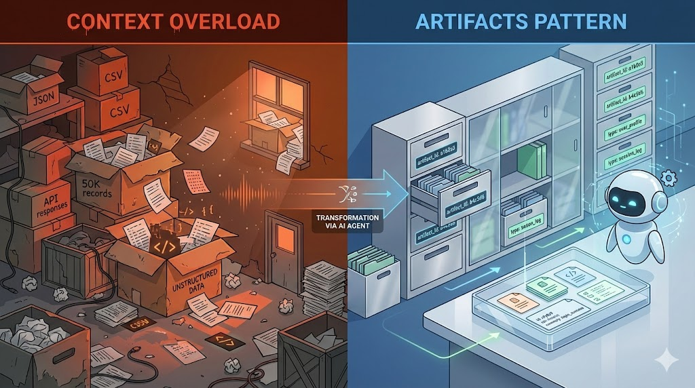
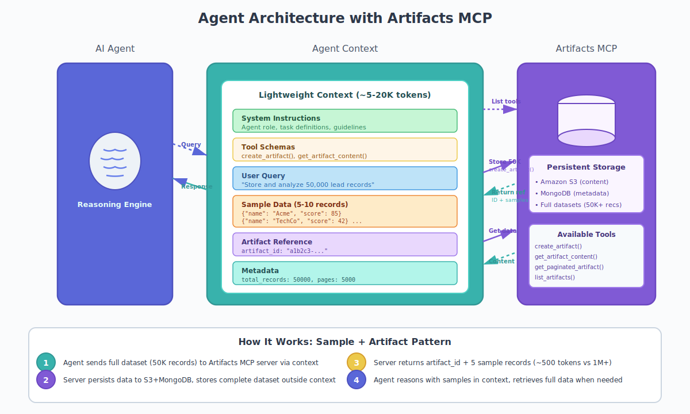
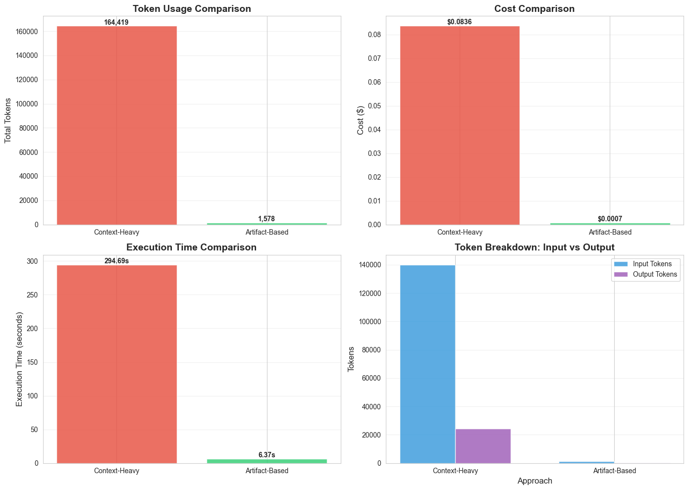
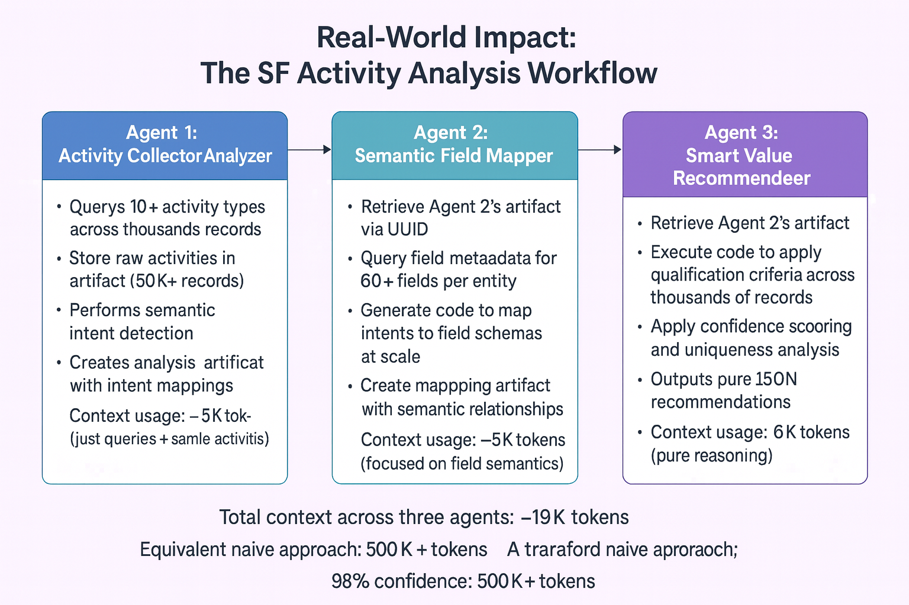

# ***Context Is Not a Storage Unit: The Artifact Pattern for Scalable AI Agents***

## Beyond Context Windows: Why Artifacts Are the Secret Sauce to Scalable AI Agents

**Your AI agent needs to analyze 50,000 Salesforce records. Loading them all into context would cost $500 and break the model. Here's how we solved it.**



*Treating context as storage leads to chaos. The artifact pattern brings order and efficiency.*

---

## The Problem Nobody Talks About

When building AI agents that work with data, everyone obsesses over prompt engineering, model selection, and function calling. But there's a fundamental architectural problem that kills most production deployments before they start:

> **Context is not a storage unit.**
> 

A common pitfall is treating LLM context windows like databases. Got 50,000 leads from Salesforce? Dump them into the context. Need to pass data between agents? Stuff it all in the conversation history. This approach has three catastrophic failure modes:

1. **Context explosion**: You blow past token limits and rack up astronomical costs
2. **Performance degradation**: Large context windows dramatically slow down model inference, causing unacceptable latency in production
3. **Information corruption**: The agent loses track of which data is current, hallucinates connections between unrelated records, and produces unreliable outputs

We discovered this the hard way while building autonomous agents for Salesforce analytics. Our agents needed to analyze tens of thousands of activity records, map them to hundreds of field definitions, and produce reliable business recommendations. The naive approach would have required millions of tokens and cost hundreds of dollars per analysis.

We needed a different architecture.

---

## The Core Insight: Separation of Concerns

Here's what we learned: **AI agents need two completely different data handling patterns:**

### 1. Understanding the Data

Agents need *sample data* for decision-making. Not the full dataset—just enough representative records to understand structure, identify patterns, and make intelligent choices. Think 5-10 carefully selected examples, not 50,000 complete records.

This aligns with Anthropic's findings on ***Progressive Disclosure*** for efficient agents. Instead of front-loading the context with every available tool definition, they found it far more effective to let agents discover tools on demand. We apply this same principle to data: provide a lightweight sample for initial understanding, and keep the full dataset in persistent storage until the agent explicitly needs to process it. ([Code execution with MCP - Anthropic](https://www.anthropic.com/engineering/code-execution-with-mcp))

### 2. Data Persistence

The full dataset needs to live *outside the context*, in a persistent storage layer that agents can reference by ID. This storage serves as the source of truth, while the agent's context remains lean and focused on reasoning.

This separation transforms how agents work:

- **Context becomes a reasoning space**, not a data warehouse
- **Persistent storage becomes the transfer mechanism** between agents, tools, and processing stages
- **Sample data provides context** without overwhelming the model

---

## The Solution: Artifacts as Your Data Layer

So how do we implement this separation in practice? Enter **artifacts**—a persistent storage layer designed specifically for AI agent workflows.

### The Artifact Contract

To make this work reliably, every artifact follows a strict contract that agents can understand. It acts as the file system for your agents, exposed via an MCP server.

**The Data Structure:**

```json
{
  "artifact_id": "uuid-v4",
  "name": "Q3_Salesforce_Leads",
  "description": "Export of 50k leads processed on Nov 15",
  "sample_data": [ ... ], // 5-10 representative records
  "full_data_location": "s3://bucket/path/to/full_dataset.json",
  "metadata": {
    "record_count": 50000,
    "schema_version": "1.0"
  }
}
```

### What Are Artifacts?

Artifacts are externalized data stores that sit outside the agent's context window. Think of them as the agent's file system: a place where large datasets, analysis results, and intermediate outputs can be saved, referenced, and retrieved without cluttering the conversation.

Key characteristics:

- **Persistent**: Data survives across agent sessions and handoffs
- **Referenceable**: Each artifact has a unique ID that agents can use to retrieve data
- **Scalable**: Can store anything from a few records to millions
- **Cost-efficient**: Moving data to artifacts reduces token usage by 95%+
- **Privacy-preserving**: Sensitive data can be processed and stored without ever entering the model's context

### Why Artifacts?

Traditional approaches force you to choose between completeness and practicality:

- **Load everything into context**: Accurate but expensive and slow
- **Load nothing**: Fast but the agent lacks information to make decisions

Artifacts give you both: the agent gets sample data for understanding, while the complete dataset lives in persistent storage, ready when needed.

---

## The Architecture: Sample + Artifact Pattern



*Figure: High-level architecture showing how AI agents interact with the Artifacts MCP server. The agent maintains a lightweight context (~5-20K tokens) with sample data and artifact references, while full datasets (50K+ records) are stored in S3 + MongoDB via the Artifacts MCP server.*

Here's how it works in practice:

### What the Agent Sees

```json
{
  "message": "Fetched 50,000 leads in 5,000 pages",
  "artifact_id": "a1b2c3d4-...",
  "sample_records": [
    { "Name": "Acme Corp", "Status": "Qualified", "Score": 85 },
    { "Name": "TechStart Inc", "Status": "New", "Score": 42 },
    { "Name": "Global Systems", "Status": "Nurturing", "Score": 67 },
    { "Name": "Innovate Ltd", "Status": "Qualified", "Score": 91 },
    { "Name": "BuildCo", "Status": "Disqualified", "Score": 15 }
  ],
  "metadata": {"total_records": 50000, "pages": 5000}
}
```

### What Actually Happened

Behind the scenes, our system:

1. **Streamed** 5,000 API calls from Salesforce (10 records per page)
2. **Persisted** each page immediately to artifact storage (S3 + MongoDB metadata)
3. **Upserted** data into a single growing artifact using incremental writes
4. **Selected** 5 records as the sample
5. **Returned** a lightweight response: artifact reference + sample + metadata

**Agent context usage:** ~500 tokens instead of 1M+

**Cost reduction:** At least 95%+

**Processing speed:** Parallel artifact storage + agent reasoning

---

## Code Execution + Artifacts: Computational Efficiency

Taking inspiration from Anthropic's work on code execution with MCP, we extend artifacts to support **computational context efficiency**. Instead of loading 50,000 records into context to analyze them, we use a **coding agent MCP server** to generate and execute code in secure sandboxes.

**The pattern:**

1. Agent retrieves artifact metadata (sees 5 sample records, not 50K full records)
2. Agent calls coding agent MCP with instructions
3. Coding agent retrieves full data from artifacts MCP, generates Python code, executes in Daytona sandbox
4. Results stored back to artifacts MCP
5. Agent receives summary + new artifact_id (~200 tokens)

**Example:**

```python
# Agent calls coding agent MCP to process data
result = generate_and_execute_code(
    prompt="Analyze 50K leads: calculate qualified rate, avg score by status, identify top 10 high-value leads",
    file_attachments=[FileAttachment(artifact_id="leads_artifact_id", name="leads.json")])

# Returns: artifact_id + "Qualified rate: 34%, Enterprise: 3x conversion"
```

Behind the scenes: 50,000 records processed with pandas, full statistical analysis, results filtered to actionable intelligence. Agent context remains clean—only insights enter the conversation.

> 💡 **Deep Dive**: For details on safe code generation, sandbox execution, and the "Analyze, Execute, Explain" pattern, see my previous article: [**Autonomous Adaptive Analytics**.](https://medium.com/@michaelw_42982/autonomous-adaptive-analytics-safe-agents-that-analyze-execute-and-explain-3d40387e7066)

---

## Experiment Results: Proof at Scale

To validate this architecture, we ran a controlled experiment comparing both approaches using real Salesforce data with 200 lead records—a modest dataset that clearly demonstrates the scaling problem.



*Figure: Comprehensive comparison of Context-Heavy vs Artifact-Based approaches processing 200 Salesforce records. The artifact pattern achieves 99% token reduction, 99.2% cost savings, and 97.8% faster execution while maintaining 100% accuracy.*

**The numbers tell a compelling story:**

| Metric | Context-Heavy | Artifact-Based | Improvement |
|--------|---------------|----------------|-------------|
| **Token Usage** | 164,419 tokens | 1,578 tokens | **99.0% reduction** |
| **Cost** | $0.0836 | $0.0007 | **99.2% savings** |
| **Execution Time** | 294.69s | 6.37s | **97.8% faster** |
| **Accuracy** | 100% | 100% | **No degradation** |

**Key insights from the experiment:**

- **Scalability proof**: With just 200 records, the context-heavy approach already consumed 164K tokens. At 50,000 records (typical enterprise scale), this would exceed most model context windows and cost over $200 per analysis.
- **Zero accuracy trade-off**: Both approaches produced identical analysis results, verified with structured outputs using Pydantic models. The artifact pattern sacrifices nothing in terms of quality.
- **Real-world viability**: The artifact-based approach completed in 6 seconds vs. nearly 5 minutes for context-heavy—the difference between interactive and unusable in production.

<div style="background-color: #DEB887; padding: 8px 12px; border-radius: 4px; display: inline-block;">

> ### Try It Yourself
>
> Want to reproduce these results? We created a [Jupyter notebook](https://github.com/yess-ai/yess-blogs/blob/main/context_is_not_a_storage_unit/artifacts_vs_context.ipynb) that runs both approaches side-by-side using the same Salesforce dataset. Simply execute the cells to see the dramatic differences in token usage, cost, and execution time—while verifying that both methods produce identical results.
>
> The notebook includes:
> - Complete implementation of both patterns
> - Real-time token counting and cost calculation
> - Side-by-side accuracy verification
> - Visualization of all metrics

</div>

---



---

## The Technical Foundation: MCP-Based Architecture

Our implementation is built on the **Model Context Protocol (MCP)**—agents interact with specialized MCP servers rather than calling services directly. This provides clean interfaces and enables powerful composition patterns.

**Core MCP Servers:**

- **Artifacts** (`ArtifactsManager`): Persistent data storage (S3 + MongoDB)
- **Coding Agent** (`CodingAgent`): Safe code generation and execution (Daytona sandboxes)
- **Salesforce** (`SalesforceManager`): CRM data with streaming pagination

**Key Artifacts MCP tools:**

- `create_artifact()` - Store data to S3 + MongoDB
- `get_artifact_content()` - Retrieve full content
- `get_paginated_artifact()` - Retrieve sliced data without loading full file
- `list_artifacts()` - Query artifacts with filters

**MCP benefits:** Isolation (single responsibility), composability (servers call servers), testability, and standardization.

---

## Key Takeaways

If you're building AI agents that work with real-world data volumes:

1. **Context is for reasoning, not storage**—keep it focused on decision-making with sample data, move full datasets to persistent storage.
2. **Artifacts enable scale**—by separating samples (understanding) from artifacts (storage) from code execution (processing), you handle 100 to 100,000+ records with the same architecture.
3. **Progressive disclosure applies to data**—load schemas and datasets on-demand, not upfront. This consistently delivers 95%+ cost savings.
4. **Privacy is architectural**—sensitive data can be processed and stored outside the model's context entirely.

The next time you're tempted to load massive datasets into context, ask: does the agent need to **understand** (use samples), **process** (use code execution), or **transfer** (use artifact references) this data? The answer determines your architecture.