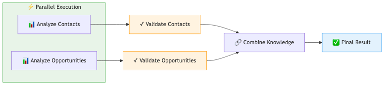
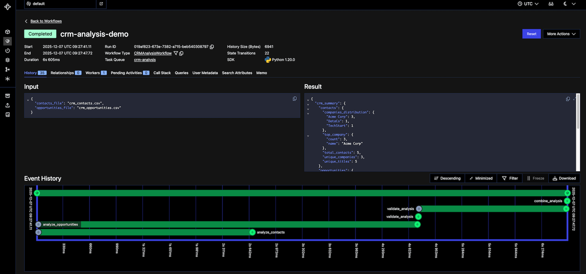

# Building Reliable Multi-Agent Workflows: Durable Execution with Validation Gates


---

> ### 📓 **Try It Yourself**
>
> Follow the [Quick Start](#quick-start) instructions below to run this demo in minutes.
>
> **You'll need:**
> - Temporal CLI installed
> - OpenAI API key
> - Python 3.8+
>
> **📦 Download:** [**durable-agentic-workflows-demo.zip**](https://github.com/yess-ai/yess-blogs/raw/main/durable-agentic-workflows/durable-agentic-workflows-demo.zip)

---

## **Section I: Why Agentic Workflows Fail in Production**

At Yess, we build AI agents that perform actions in your CRM.

A key challenge is understanding each customer's specific CRM structure. Their unique objects, fields, relationships, and business logic - Which we do using agents.

Our initial CRM agents were highly effective for small datasets. However, as we onboarded enterprise clients...

Data volumes exploded. Agentic workflows that took just a few minutes now ran 10, 20, even 45 minutes. More data meant more tool calls - querying CRM APIs, fetching schemas, analyzing records, each one another chance for failure. Each failure meant restarting from scratch, wasting time and money.

> ❌ The Silent Failure
>
>
> The workflow completes successfully, but an agent hallucinated something midway through. Everything downstream is poisoned. Restart from scratch.
>

---

## **Section II: What We Needed**

We couldn't keep restarting 45-minute workflows. After testing different approaches, we boiled it down to three essential requirements:

### **1. Durable Execution with Smart Failure Handling**

Infrastructure **will** fail. When it does, minimize what you lose and fail fast when needed.

**Checkpointing:** Save progress after each step. If something breaks, resume from the last checkpoint instead of restarting from scratch.

**Timeouts & Retries:** Define reasonable completion times and retry limits. When exceeded, fail fast instead of waiting indefinitely.

### **2. Validation Checkpoints (Catch Issues Early)**

An agent finishing isn't enough, we need to verify it did a good job. Validations must be:

- **Fast** - don't slow down the pipeline
- **Early** - catch problems before wasting downstream work
- **Specific** - allow retries on the exact failed step, not the entire workflow
- **Informative** - semantically analyze outputs and pass validation failure reasons to retries for targeted fixes

### **3. Stay Optimized**

Balance reliability with efficiency - minimize execution time without compromising durability.

---

### **The Solution - Task Decomposition**

Breaking complex workflows into small steps unlocks all three requirements:

- **Enables durable execution:** Checkpoint after each small step instead of losing hours of work
- **Makes validation practical:** Verify small outputs instead of massive mixed results
- **Reveals optimization:** See which steps are independent and can run in parallel

| **Aspect** | **Before Task Decomposition** | **After Task Decomposition** |
| --- | --- | --- |
| ⚠️ System Failure Impact | ❌ Lose entire workflow (45 min) | ✅ Lose one step (1-8 min) |
| 🔍 Validation Failure Impact | ❌ Re-run entire workflow | ✅ Re-run only failed step |
| 📊 Validation Scope | ❌ Validate 2000+ lines of mixed output | ✅ Validate 200 lines per step |
| ⚡ Optimization | 🐌 Everything runs sequentially | 🚀 Independent steps run in parallel |

---

## **Section III: Building the Workflow - A Complete Example**

We'll build a simplified CRM analysis workflow that demonstrates all three requirements in action. The workflow analyzes mock CRM data (contacts and opportunities) to extract insights about customers opportunities.

**What you'll see:**

- **Durable execution** - checkpointing after each step, automatic resume on failure
- **Validation** - catching issues before they propagate
- **Parallel optimization** - running independent analyses concurrently

### **Workflow Architecture**



Each box is a **checkpoint** - if any step fails, Temporal resumes from the last successful checkpoint.

---

## *What You Need to Know Before We Begin*

| Component | Purpose | Type | Key Features |
|-----------|---------|------|--------------|
| 🏗️ **[Temporal](https://temporal.io/)** | Durable execution engine | Infrastructure (requires install) | • Checkpointing & automatic retries<br>• Timeout policies<br>• Web UI for monitoring |
| 🤖 **[Agno](https://docs.agno.com/)** | AI agent framework | SDK/Library | • Lightweight & fast<br>• Structured outputs with Pydantic<br>• Works with any LLM provider |
| 🔑 **[OpenAI API](https://platform.openai.com/)** | LLM provider | API (key required) | • gpt-4o-mini for cost-effective analysis<br>• Reliable structured JSON outputs |

---

### **Prerequisites**

Before starting, ensure you have:

1.  **Temporal CLI installed** ([instructions](https://docs.temporal.io/cli/))
2.  **Python 3.8+ installed**
3.  **OpenAI API Key** (from [platform.openai.com](https://platform.openai.com))

---

### **Quick Start**

**Step 1: Start Temporal Server (Terminal 1)**

Open a terminal and run:

```bash
temporal server start-dev
```

Keep this terminal open - the server must stay running.

**Step 2: Download and Run Workflow (Terminal 2)**

Open a **new terminal** and run:

```bash
# Download the demo zip
curl -LO https://github.com/yess-ai/yess-blogs/raw/main/durable-agentic-workflows/durable-agentic-workflows-demo.zip

# Extract
unzip durable-agentic-workflows-demo.zip

# Create and activate virtual environment
python3 -m venv .durable-agentic-workflows
source .durable-agentic-workflows/bin/activate  # On Windows: .durable-agentic-workflows\Scripts\activate

# Install dependencies
pip install -r requirements.txt

# Set your OpenAI API key
export OPENAI_API_KEY=sk-your-key-here

# Run the workflow
python run.py
```

**Watch it live:** Open [**http://localhost:8233**](http://localhost:8233/) to see the workflow executing in real-time.

---

### **Step 1/4: Define the Workflow** (`workflow.py`)

The workflow orchestrates three processing steps with validation between them. See the full code in the repo.

> **💡 Key Highlights**
>
> ✓ Parallel execution with `asyncio.gather()` - contacts and opportunities analyzed concurrently
>
> ✓ Checkpointing after each `execute_activity` - state persisted automatically
>
> ✓ Validation gates before final combination - catch issues early
>
> ✓ Different timeout policies - analysis gets 2 min, validation gets 30 sec

---

### **Step 2/4: Implement Activities** (`activities.py`)

Activities do the actual work - using Agno AI agents to analyze data and validate outputs. See the full code in the repo.

> **💡 Key Highlights**
>
> ✓ Structured outputs with Pydantic models - reliable JSON from LLMs
>
> ✓ Hybrid validation - deterministic checks first (fast), then AI validation
>
> ✓ Fail fast on simple errors - save AI costs by not running expensive checks
>
> ✓ Type safety - Pydantic validates response schemas automatically
>
> ✓ Retriable - if any activity fails, Temporal retries automatically

---

### **Step 3/4: Run the Workflow** (`run.py`)

The runner starts a worker and executes the workflow. See the full code in the repo.

> **💡 Key Highlights**
>
> ✓ Worker registers all activities and workflows
>
> ✓ Connects to Temporal server on `localhost:7233`
>
> ✓ Workflow ID enables tracking and resumption
>
> ✓ Task queue isolates different workflow types

**Expected output:**

```
🔧 Worker started. Listening for workflows...

============================================================
✅ Analysis completed successfully!
============================================================
{
  "crm_summary": {
    "contacts": {
      "companies_distribution": { "Acme Corp": 3, "DataCo": 1, "TechStart": 1 },
      "top_company": { "count": 3, "name": "Acme Corp" },
      "total_contacts": 5,
      "unique_companies": 3,
      "unique_titles": 4
    },
    "opportunities": {
      "stages_breakdown": { "Closed Won": 2, "Negotiation": 1, "Prospecting": 1 },
      "total_opportunities": 4,
      "total_pipeline_value": 130000.0,
      "win_rate": 0.615,
      "won_value": 80000.0
    }
  },
  "key_insights": [
    "Managing 5 contacts across 3 companies",
    "Top customer: Acme Corp (3 contacts)",
    "Pipeline value: $130,000 across 4 opportunities",
    "Closed revenue: $80,000 (Win rate: 61.5%)"
  ],
  "status": "analysis_completed_successfully"
}
```

---

### **Step 4/4: Explore in Temporal UI**

Open [**http://localhost:8233**](http://localhost:8233/) in your browser to see the workflow in action.

**You'll see:**

1. **Workflows page** - your workflow with ID `crm-analysis-demo`
2. **Event history** - every activity execution, checkpoint, retry in real-time
3. **Parallel execution** - contacts and opportunities start at the same timestamp
4. **Activity inputs/outputs** - full data for debugging

**Try breaking it:**

| Test | How | What Happens |
|------|-----|--------------|
| **Validation failure** | Make `validate_analysis` return `{"passed": False}` | Workflow stops early, reports failure reason |
| **Infrastructure failure** | Kill process mid-workflow (Ctrl+C), then restart | Resumes from last checkpoint, not from scratch |
| **Activity retry** | Add `raise Exception()` randomly in an activity | Temporal automatically retries the failed activity |



---

## **Section IV: What You Just Built**

**✅ Durable execution in action:**

- Each activity checkpointed after completion
- Kill the process mid-workflow → restart resumes from last checkpoint
- No repeated work, no lost progress

**✅ Hybrid validation catching issues:**

- Deterministic checks catch 90% of errors instantly (missing fields, negatives, invalid ranges)
- AI validation catches semantic issues and hallucinations
- Fail fast on simple errors, save AI costs by not running expensive checks unnecessarily
- Clear error messages show exactly what failed

**✅ Parallel optimization:**

- Contacts and opportunities analyzed concurrently
- Independent operations run simultaneously
- Execution time cut in half

**This is the exact pattern we use in production** - same structure, same checkpointing, same validation gates. The only difference: real CRM APIs instead of CSV files, and actual LLM agents doing long complex work instead of mock analysis functions.

---

## **Section V: Key Takeaways**

- **Task decomposition unlocks reliability:** Breaking workflows allows for checkpointing, granular validation, and parallel execution.
- **Durable execution + Validation:** Temporal handles infrastructure failures, while validation gates catch AI hallucinations. You need both.
- **Hybrid validation saves costs:** Run fast, cheap deterministic checks first. Only use expensive AI validation for semantic checks.
- **Tailor your policies:** Don't use one-size-fits-all settings. Give analysis steps longer timeouts and validation steps shorter ones.
