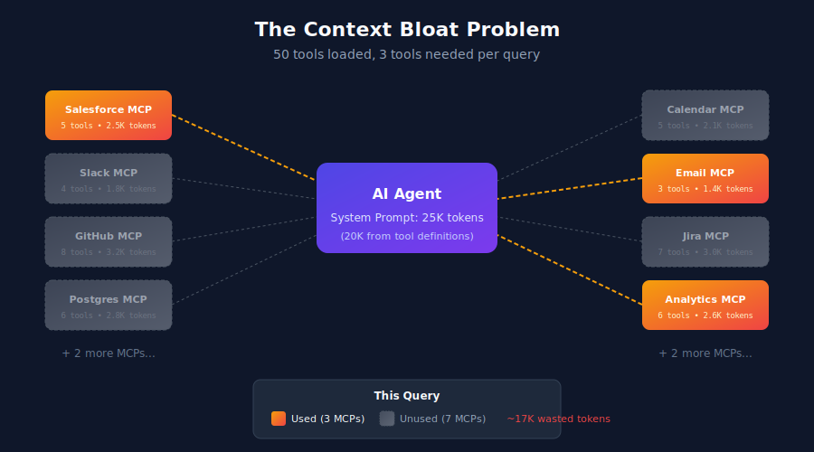
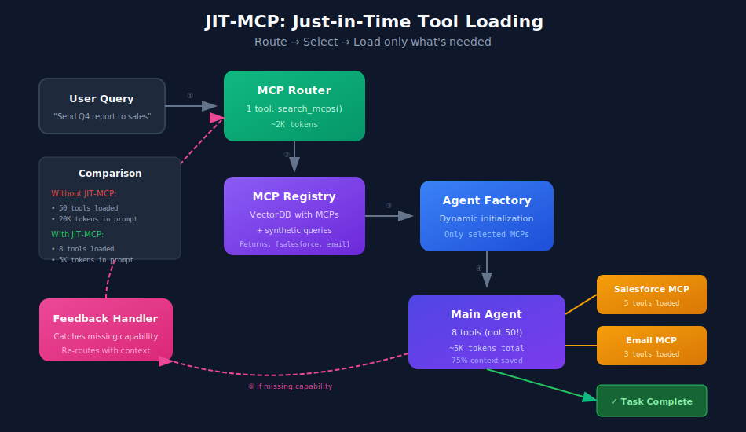
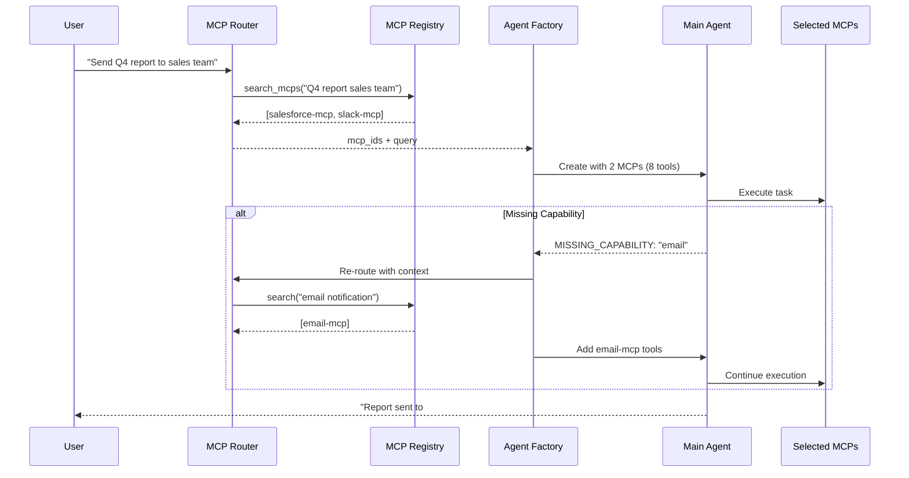
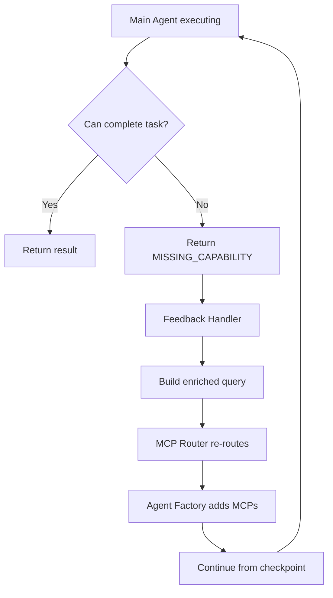

# Just-in-Time MCP: Dynamic Tool Selection for Scalable AI Agents


**TL;DR:** As agents accumulate MCP connections, they drown in tool definitions—burning context tokens and confusing themselves about which tools to use. JIT-MCP fixes this by routing queries through a lightweight agent that dynamically selects only the MCPs needed per task.

---

## **Section I: The Problem — Why MCP-Heavy Agents Fail at Scale**

MCP (Model Context Protocol) is becoming the standard interface between AI agents and external capabilities. GitHub, Slack, databases, APIs—everything speaks MCP now. This is great for interoperability.

It's terrible for your agent's cognitive load.

**The pattern we're seeing:** Teams connect their agent to every MCP they might need. Salesforce for CRM, Slack for notifications, GitHub for code, Postgres for data, Calendar for scheduling... suddenly your agent has 50+ tools before it even says hello.

This creates two catastrophic failure modes:

### **1. Context Explosion**

Every MCP tool comes with a schema definition that must live in the system prompt. Let's do the math:

| Component | Tokens |
|-----------|--------|
| Average tool definition (name, description, parameters, examples) | 300-500 |
| 10 MCPs × 5 tools each = 50 tools | **15,000-25,000** |
| Your actual system prompt instructions | 2,000-5,000 |
| **Total before user says anything** | **17,000-30,000** |

On Claude Sonnet at $3/M input tokens, that's **$0.05-0.09 per conversation initialization**. Sounds small until you're running 10,000 conversations per day.

But cost isn't even the real problem. **You're burning 15% of your context window on tools the user might never need.** That's 15% less room for conversation history, retrieved documents, and actual reasoning.



*Figure: An agent loaded with 10+ MCPs. Most tools sit unused per query, but all consume context.*

### **2. Tool Selection Degradation**

More tools doesn't mean more capable. It means more confused.

Research on function calling shows accuracy degrades significantly beyond 15-20 tools. The model faces a combinatorial explosion: "Which of these 50 tools should I use? In what order? With what parameters?"

**Common failure modes:**

- **Wrong tool selection:** Agent picks `search_contacts` when it needed `query_leads`
- **Tool hallucination:** Agent invents tool names or parameters that don't exist
- **Coordination failures:** Multi-step tasks require tools from different MCPs, agent loses track
- **Analysis paralysis:** Agent wastes tokens reasoning about which tool to use instead of just doing the task

The cruel irony: you added all those MCPs to make your agent more capable, but you actually made it worse.

> **The core insight:** Giving an agent access to 50 tools when it only needs 3 for the current task is like handing someone a 200-page manual when they asked how to turn on the TV.

---

## **Section II: Design Requirements**

Before jumping to solutions, let's define what "fixed" looks like:

### **1. Minimal Initial Context**

The routing layer should have exactly **one tool**—a RAG search over MCP capabilities. Not 50. One.

### **2. Intent-Based Selection**

Match user queries to capabilities semantically, not by keyword. "Show me last quarter's numbers" should find `salesforce-mcp` even though the word "Salesforce" never appears.

### **3. Graceful Recovery**

If the router misses an MCP that's needed mid-execution, the system should recover without restarting the entire conversation. Missing capability = signal to re-route, not failure.

### **4. Low Latency Overhead**

Routing should add <500ms to the request. We're trading a small latency hit for massive context savings—that trade needs to be worth it.

### **5. Zero-Configuration Extensibility**

Adding a new MCP shouldn't require touching prompts or code. Register it in the MCP Registry, and the router discovers it automatically via RAG.

---

## **Section III: The JIT-MCP Architecture**

JIT-MCP (Just-in-Time MCP) borrows from just-in-time compilation: don't load everything upfront, load what you need when you need it.



*Figure: The JIT-MCP flow. User query routes through a lightweight agent, which retrieves relevant MCPs from the registry, and the factory creates a focused main agent with only the tools needed.*

### **High-Level Architecture**

```
┌─────────────────────────────────────────────────────────────────────┐
│                         JIT-MCP System                              │
├─────────────────────────────────────────────────────────────────────┤
│                                                                     │
│   User Query                                                        │
│       │                                                             │
│       ▼                                                             │
│   ┌─────────────────┐    ┌─────────────────┐                       │
│   │   MCP Router    │───▶│  MCP Registry   │                       │
│   │  (1 RAG tool)   │◀───│   (VectorDB)    │                       │
│   └────────┬────────┘    └─────────────────┘                       │
│            │                                                        │
│            │ [mcp_ids]                                              │
│            ▼                                                        │
│   ┌─────────────────┐                                              │
│   │  Agent Factory  │                                              │
│   │ (Dynamic Init)  │                                              │
│   └────────┬────────┘                                              │
│            │                                                        │
│            ▼                                                        │
│   ┌─────────────────┐         ┌─────────────────┐                  │
│   │   Main Agent    │────────▶│ Selected MCPs   │                  │
│   │ (3-5 tools max) │◀────────│ (Lazy Loaded)   │                  │
│   └────────┬────────┘         └─────────────────┘                  │
│            │                                                        │
│            │ missing_capability?                                    │
│            ▼                                                        │
│   ┌─────────────────┐                                              │
│   │Feedback Handler │───▶ Re-route with enriched context           │
│   └─────────────────┘                                              │
│                                                                     │
└─────────────────────────────────────────────────────────────────────┘
```

### **Component 1: MCP Router Agent**

A lightweight agent with a single purpose: understand what the user needs and find the MCPs that can deliver it.

```python
# Pseudocode: MCP Router Agent

class MCPRouterAgent:
    """
    Lightweight agent with ONE tool: search_mcps
    Analyzes user intent and returns relevant MCP IDs
    """
    
    system_prompt = """
    You are an MCP routing agent. Your job is to analyze the user's query
    and determine which MCP servers are needed to fulfill the request.
    
    Use the search_mcps tool to find relevant MCPs based on the query.
    Return the minimal set of MCP IDs needed—don't over-select.
    
    If the query is ambiguous, err on the side of including MCPs rather
    than missing critical capabilities.
    """
    
    tools = [
        Tool(
            name="search_mcps",
            description="Search the MCP registry for servers matching the query intent",
            parameters={
                "query": "The user's intent or capability needed",
                "top_k": "Number of MCPs to retrieve (default: 5)"
            },
            handler=self.search_mcp_registry
        )
    ]
    
    async def route(self, user_query: str) -> List[str]:
        """
        Returns list of MCP IDs needed for the query
        """
        response = await self.run(user_query)
        return response.selected_mcp_ids
```

**Why one tool?** The router's context is ~2,000 tokens total. It can reason clearly about intent without drowning in irrelevant tool definitions.

### **Component 2: MCP Registry (VectorDB)**

The knowledge base that makes routing possible. Each MCP is stored as a document with rich metadata for semantic search.

```python
# Pseudocode: MCP Registry

class MCPRegistry:
    """
    VectorDB storing MCP metadata for semantic retrieval
    """
    
    def __init__(self, vector_store: VectorStore):
        self.store = vector_store
    
    def register_mcp(self, mcp_config: MCPConfig):
        """
        Register an MCP with its tools and synthetic queries
        """
        document = {
            "mcp_id": mcp_config.id,
            "name": mcp_config.name,
            "description": mcp_config.description,
            "tools": [
                {"name": t.name, "description": t.description}
                for t in mcp_config.tools
            ],
            # KEY: Synthetic queries for semantic matching
            "synthetic_queries": mcp_config.synthetic_queries,
            "capabilities": mcp_config.capabilities
        }
        
        # Embed the full document for semantic search
        embedding = self.embed(self._flatten_for_embedding(document))
        self.store.upsert(mcp_config.id, document, embedding)
    
    def search(self, query: str, top_k: int = 5) -> List[MCPConfig]:
        """
        Semantic search for MCPs matching the query intent
        """
        query_embedding = self.embed(query)
        results = self.store.similarity_search(query_embedding, top_k)
        return [self._to_mcp_config(r) for r in results]
```

### **Component 3: Agent Factory**

Takes the router's output and constructs a main agent with only the selected MCPs.

```python
# Pseudocode: Agent Factory

class AgentFactory:
    """
    Dynamically creates agents with selected MCPs
    """
    
    def __init__(self, mcp_connections: Dict[str, MCPConnection]):
        # Pre-established connections to all MCPs (but not loaded into context)
        self.connections = mcp_connections
    
    async def create_agent(
        self, 
        mcp_ids: List[str], 
        user_query: str
    ) -> MainAgent:
        """
        Create agent with only the selected MCPs
        """
        # Gather tools only from selected MCPs
        tools = []
        for mcp_id in mcp_ids:
            conn = self.connections[mcp_id]
            tools.extend(await conn.list_tools())
        
        # Create agent with focused tool set
        return MainAgent(
            tools=tools,  # 10-15 tools, not 50
            user_query=user_query,
            active_mcps=mcp_ids
        )
```

### **Component 4: Feedback Handler**

Catches "I can't do this" signals and triggers re-routing.

```python
# Pseudocode: Feedback Handler

class FeedbackHandler:
    """
    Handles missing capability signals from main agent
    """
    
    MISSING_CAPABILITY_SIGNAL = "MISSING_CAPABILITY"
    
    async def handle_response(
        self, 
        response: AgentResponse,
        original_query: str,
        router: MCPRouterAgent,
        factory: AgentFactory
    ) -> AgentResponse:
        """
        If agent signals missing capability, re-route and continue
        """
        if response.status != self.MISSING_CAPABILITY_SIGNAL:
            return response
        
        # Build enriched query for better retrieval
        enriched_query = f"""
        Original request: {original_query}
        
        Already tried MCPs: {response.attempted_mcps}
        Completed steps: {response.completed_steps}
        Missing capability: {response.missing_capability}
        """
        
        # Re-route with enriched context
        additional_mcps = await router.route(enriched_query)
        
        # Expand agent's capabilities
        new_mcp_ids = list(set(response.attempted_mcps + additional_mcps))
        expanded_agent = await factory.create_agent(new_mcp_ids, original_query)
        
        # Continue from where we left off
        return await expanded_agent.continue_from(response.checkpoint)
```

### **The Full Flow**



---

## **Section IV: The MCP Registry Contract**

The registry is the brain of JIT-MCP. Its design determines routing quality.

### **Document Schema**

```json
{
  "mcp_id": "salesforce-mcp",
  "name": "Salesforce CRM",
  "description": "Full CRM operations including leads, contacts, opportunities, accounts, and reporting. Supports SOQL queries and bulk operations.",
  
  "tools": [
    {
      "name": "query_records",
      "description": "Execute SOQL query against any Salesforce object",
      "parameters": {
        "soql": "SOQL query string",
        "limit": "Max records to return"
      }
    },
    {
      "name": "create_record",
      "description": "Create a new record in any Salesforce object",
      "parameters": {
        "object_type": "Lead, Contact, Opportunity, etc.",
        "fields": "Field values for the new record"
      }
    },
    {
      "name": "update_record",
      "description": "Update an existing Salesforce record",
      "parameters": {
        "record_id": "18-character Salesforce ID",
        "fields": "Fields to update"
      }
    }
  ],
  
  "synthetic_queries": [
    "Show me all leads from last week",
    "What's our pipeline value for Q4?",
    "Create a new contact for the Acme deal",
    "Find opportunities closing this month",
    "Who are our top accounts by revenue?",
    "Update the status on the TechCorp opportunity",
    "How many leads converted last quarter?",
    "List all contacts at enterprise accounts",
    "What's the win rate for our sales team?",
    "Show deals stuck in negotiation stage"
  ],
  
  "capabilities": [
    "crm",
    "leads", 
    "contacts",
    "opportunities",
    "accounts",
    "reporting",
    "pipeline",
    "sales"
  ]
}
```

### **Why Synthetic Queries Matter**

The `synthetic_queries` field is the secret sauce. Raw tool descriptions are often too technical for semantic matching:

| User Says | Tool Description | Match? |
|-----------|------------------|--------|
| "What's our pipeline?" | "Execute SOQL query against Salesforce objects" | ❌ Weak |
| "What's our pipeline?" | "What's our pipeline value for Q4?" | ✅ Strong |

Synthetic queries bridge the gap between how users talk and how tools are documented.

### **Generating Synthetic Queries**

Use an LLM to generate diverse queries for each MCP:

```python
GENERATION_PROMPT = """
Given this MCP server and its tools, generate 15-20 realistic user queries 
that would require this MCP to fulfill.

MCP: {mcp_name}
Description: {mcp_description}
Tools: {tool_list}

Requirements:
- Vary phrasing (questions, commands, casual requests)
- Cover all tools
- Include edge cases
- Use natural language, not technical jargon

Output as JSON array of strings.
"""

async def generate_synthetic_queries(mcp_config: MCPConfig) -> List[str]:
    response = await llm.complete(
        GENERATION_PROMPT.format(
            mcp_name=mcp_config.name,
            mcp_description=mcp_config.description,
            tool_list=format_tools(mcp_config.tools)
        )
    )
    return json.loads(response)
```

### **Embedding Strategy**

For the document embedding, concatenate fields with semantic weight:

```python
def flatten_for_embedding(doc: dict) -> str:
    """
    Create embedding-optimized text representation
    """
    parts = [
        f"MCP: {doc['name']}",
        f"Description: {doc['description']}",
        f"Capabilities: {', '.join(doc['capabilities'])}",
        "Tools: " + ", ".join(t['name'] + ": " + t['description'] for t in doc['tools']),
        "Example queries: " + " | ".join(doc['synthetic_queries'])
    ]
    return "\n".join(parts)
```

---

## **Section V: The Feedback Loop — Handling Missing Tools**

The router won't always get it right on the first try. Complex queries might need MCPs the router didn't anticipate. **This isn't failure—it's a signal.**

### **The Missing Capability Contract**

When the main agent realizes it can't complete a task, it returns a structured signal:

```json
{
  "status": "MISSING_CAPABILITY",
  "original_query": "Send the Q4 pipeline report to the sales team via email",
  "attempted_mcps": ["salesforce-mcp"],
  "completed_steps": [
    "Retrieved Q4 pipeline data from Salesforce",
    "Generated summary report"
  ],
  "checkpoint": "report_generated",
  "missing_capability": "email sending / notification",
  "reasoning": "I have the report ready but no tool to send emails. The Salesforce MCP only handles CRM data, not notifications."
}
```

### **Re-Routing Flow**



### **Enriched Query Construction**

The feedback handler builds context that helps the router make a better decision:

```python
def build_enriched_query(response: MissingCapabilityResponse) -> str:
    return f"""
    TASK: {response.original_query}
    
    ALREADY AVAILABLE:
    - MCPs: {', '.join(response.attempted_mcps)}
    - Completed: {'; '.join(response.completed_steps)}
    
    STILL NEEDED:
    - Capability: {response.missing_capability}
    - Agent's reasoning: {response.reasoning}
    
    Find MCPs that provide the missing capability.
    """
```

This enriched query has much higher retrieval precision because it includes:
1. What was already tried (avoid re-selecting same MCPs)
2. What specific capability is missing
3. The agent's own reasoning about the gap

### **Preventing Infinite Loops**

Guard against re-routing forever:

```python
MAX_REROUTES = 3

async def execute_with_feedback(query: str) -> AgentResponse:
    reroute_count = 0
    mcp_ids = await router.route(query)
    
    while reroute_count < MAX_REROUTES:
        agent = await factory.create_agent(mcp_ids, query)
        response = await agent.execute()
        
        if response.status != "MISSING_CAPABILITY":
            return response
        
        # Re-route with enriched context
        enriched = build_enriched_query(response)
        additional = await router.route(enriched)
        
        if not additional or set(additional) <= set(mcp_ids):
            # No new MCPs found, give up gracefully
            return AgentResponse(
                status="INCOMPLETE",
                message=f"Could not find MCP for: {response.missing_capability}",
                partial_result=response.completed_steps
            )
        
        mcp_ids = list(set(mcp_ids + additional))
        reroute_count += 1
    
    return AgentResponse(status="MAX_REROUTES_EXCEEDED", ...)
```

---

## **Section VI: When to Use JIT-MCP**

JIT-MCP adds complexity. Make sure it's worth it.

### **Use JIT-MCP When:**

| Condition | Why It Helps |
|-----------|--------------|
| **10+ connected MCPs** | Context savings compound with MCP count |
| **Diverse task types** | Users don't always need all MCPs |
| **Cost-sensitive workloads** | 15K tokens saved per request adds up |
| **MCPs with overlapping domains** | Router can disambiguate better than 50-tool confusion |
| **Frequently adding new MCPs** | Zero-config extensibility via registry |

### **Skip JIT-MCP When:**

| Condition | Why It's Overkill |
|-----------|-------------------|
| **3-5 focused MCPs** | Context overhead is manageable |
| **Homogeneous tasks** | Same MCPs always needed, no routing value |
| **Ultra-low latency (<100ms)** | Routing adds 200-500ms overhead |
| **Simple tool sets** | If tools are orthogonal, selection is easy |

### **The Break-Even Calculation**

```
Routing overhead: ~300ms + 2K tokens (router agent)
Context savings: ~15K-25K tokens (avoided tool definitions)

Break-even at: ~6-8 MCPs with 5+ tools each
Clear win at: 10+ MCPs
```

If your agent has fewer than 6 MCPs, the routing overhead probably isn't worth it. If you have 15+, you're leaving money and accuracy on the table without JIT-MCP.

---

## **Section VII: Key Takeaways**

### **1. MCP Sprawl is the New Dependency Hell**

More tools ≠ more capable. Every MCP you add consumes context and increases cognitive load. Be intentional about what your agent has access to—per request, not globally.

### **2. Intent-Based Routing Beats Keyword Matching**

The synthetic queries in the MCP Registry enable semantic matching. "Show me last quarter's numbers" finds `salesforce-mcp` because the registry contains "What's our pipeline value for Q4?"—not because of keyword overlap.

### **3. Feedback Loops Enable Self-Correction**

A missing capability isn't a failure state—it's a signal. By catching these signals and re-routing with enriched context, JIT-MCP handles edge cases without human intervention.

### **4. Trade Routing Latency for Context Efficiency**

300ms of routing overhead saves 15,000+ tokens of tool definitions. At scale, this trade-off isn't even close. You get better accuracy (fewer tools = clearer decisions) AND lower costs.

### **5. The Router is Dumb, The Registry is Smart**

Keep the router agent simple—one tool, minimal prompt. Put the intelligence in the registry: rich descriptions, diverse synthetic queries, capability tags. This separation makes the system maintainable and extensible.

---

## **What's Next**

JIT-MCP is a pattern, not a product. To implement it, you'll need:

1. **Vector store** for the MCP Registry (Pinecone, Weaviate, pgvector, etc.)
2. **MCP connection pool** with lazy loading capabilities
3. **Agent framework** that supports dynamic tool injection
4. **Synthetic query generation** pipeline for new MCPs

The architecture is framework-agnostic—whether you're using LangChain, Agno, CrewAI, or raw API calls, the pattern applies.

---

*Have questions or want to discuss JIT-MCP implementation? Reach out on [LinkedIn](https://linkedin.com) or [Twitter](https://twitter.com).*

